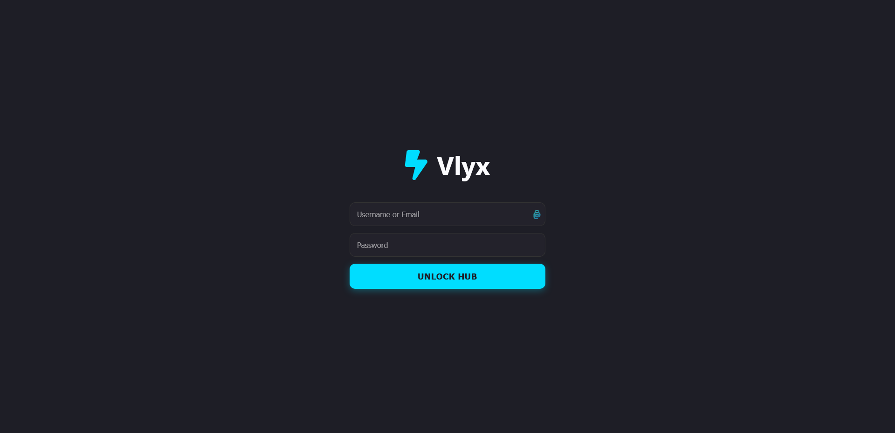

# ⚡ Vlyx Hub

**Vlyx Hub** is a lightweight, self-hosted bookmark manager designed for speed and minimalism. It provides a sleek, dark-themed dashboard to organize your most important links without the bloat of traditional managers.

> [!TIP]
> **Privacy First**: Vlyx uses a flat-file JSON database. No SQL setup is required, and your data stays entirely under your control.

---

## ✨ Features

* **⚡ Sublime Interface**: A modern, responsive dark-mode UI with vibrant accents.
* **🛠️ Guided Setup**: A foolproof, step-by-step installation wizard for first-time users.
* **📂 Multi-User Support**: Each user gets their own personal space and link grid.
* **🚀 Update Checker**: Real-time notifications when a new version is available on GitHub.
* **🔒 Security**: Built-in password hashing and protected data directories via `.htaccess`.
* **📱 Compact Control**: Manage everything from a minimalist bar at the bottom of your screen.

---

## 📸 Screenshots

*(Tip: Add your own screenshots from the `Demo` folder here to make it visual!)*

| Login Portal | Dashboard | User Management |
| :--- | :--- | :--- |
|  |  |  |

---

## 🚀 Quick Start

Installing Vlyx is incredibly simple:

1.  **Download/Clone**: Upload the files to your PHP-enabled web server.
2.  **Permissions**: Ensure the root folder is writable.
3.  **Run**: Navigate to your site. The **Auto-Installer** will guide you through creating your first Admin account.
4.  **Login**: Enter your credentials and start adding links!

---

## 🛠️ Tech Stack

* **Backend**: PHP 8.1+
* **Storage**: JSON (No-SQL)
* **Styling**: CSS3 (Grid & Flexbox)
* **Icons**: FontAwesome 6.5.1

---

## 🤝 Contributing

Contributions are welcome! Whether it's a bug report, a feature request, or a pull request, feel free to join the development of Vlyx.

1.  Fork the Project
2.  Create your Feature Branch (`git checkout -b feature/AmazingFeature`)
3.  Commit your Changes (`git commit -m 'Add some AmazingFeature'`)
4.  Push to the Branch (`git push origin feature/AmazingFeature`)
5.  Open a Pull Request

---

## 📜 License

Distributed under the **MIT License**. See `LICENSE` for more information.

---

Built with ⚡ by **Aldon** • 2026 • [GitHub Repository](https://github.com/ByAldon/vlyx)